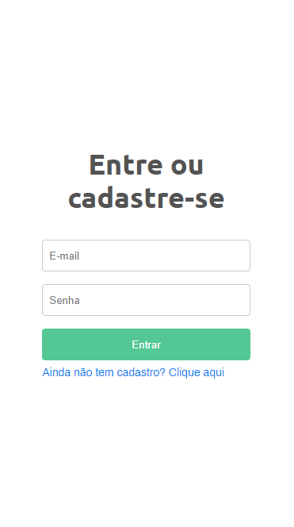
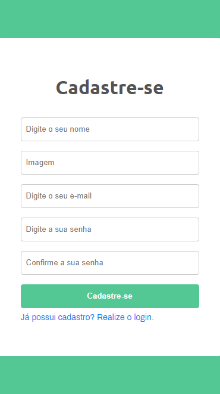
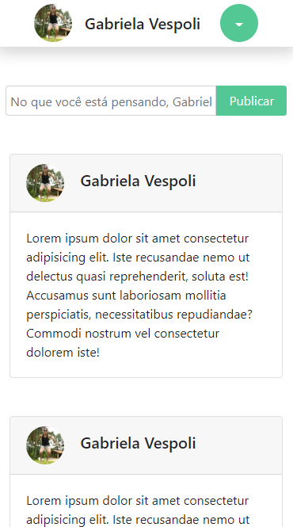
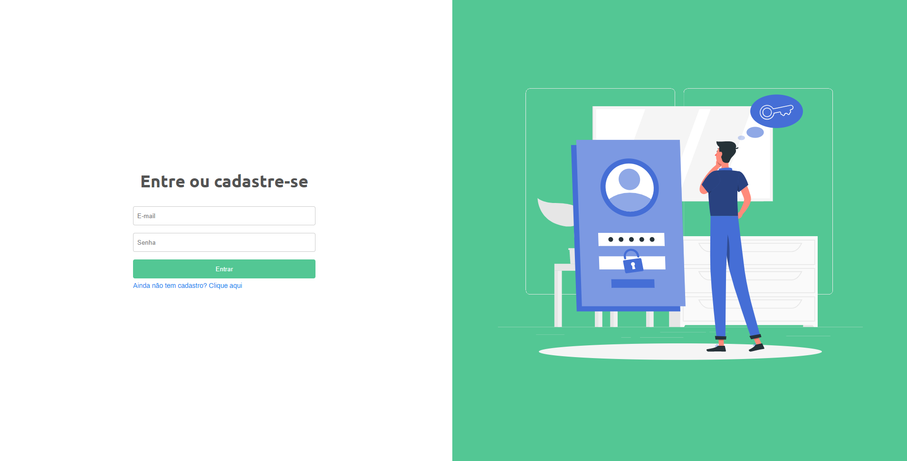
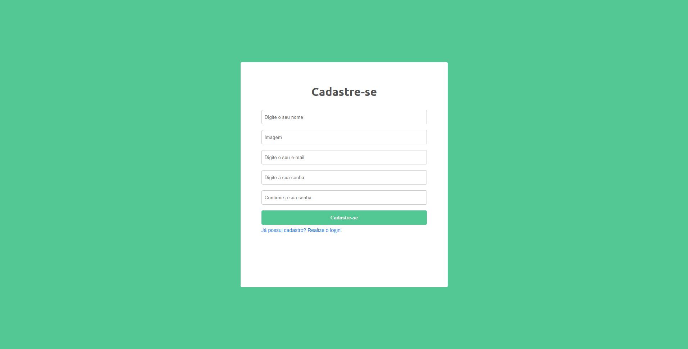
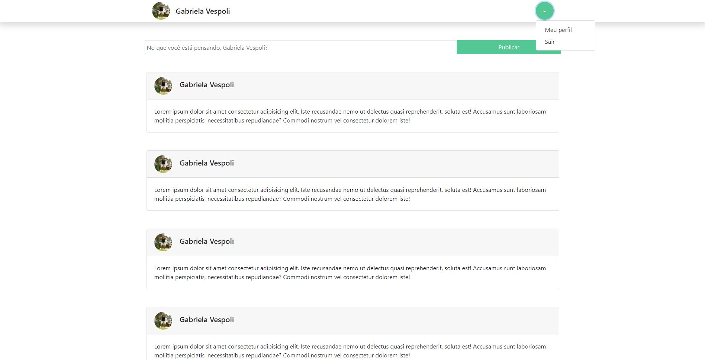

<h1 align="center">
    
</h1>

<h4 align="center"> 
	🚧  Sistema Login 🚀 Em construção  🚧
</h4>

 <a href="#-sobre-o-projeto">Sobre</a> •
 <a href="#-funcionalidades">Funcionalidades</a> •
 <a href="#-layout">Layout</a> • 
 <a href="#-tecnologias">Tecnologias</a> • 
 <a href="#user-content--licença">Licença</a>

## 💻 Sobre o projeto

🚀 Sistema login - é uma plataforma web que realiza cadastro de usuários e login em sua home page pessoal.

Projeto desenvolvido durante a **Formação Full Stack** oferecida pela [Recode](https://recode.org.br/).
A Recode é uma organização social que promove o empoderamento digital. Por meio da criação e disseminação de metodologias de formação empreendedora e do uso de ferramentas digitais, busca ampliar o impacto de facilitadores em comunidades, escolas e bibliotecas e estimular o uso ético, consciente e cidadão da tecnologia.

---

## ⚙️ Funcionalidades

- [x] qualquer usuário pode se cadastrar na plataforma web enviando:

  - [x] nome
  - [x] imagem (para o perfil)
  - [x] email
  - [x] senha

---

## 🎨 Layout

O layout da aplicação:

### Mobile

  

  

  

### Web

  

  
  
  

---

## 🛠 Tecnologias

As seguintes ferramentas foram usadas na construção do projeto:

- PHP

- MySQL

- Bootstrap

- HTML

- CSS

#### **Utilitários**

- Editor: **[Visual Studio Code](https://code.visualstudio.com/)**
- Banco de dados: **[MySql Workbench](https://www.mysql.com/products/workbench/)**
- PHP: **[PHPMyAdmin](https://www.phpmyadmin.net/)**

---

## 📝 Licença

Este projeto esta sobe a licença [MIT](./LICENSE).

Feito com ❤️ por Gabriela Vespoli 👋🏽 [Entre em contato!](https://www.linkedin.com/in/gabihvespoli/)
